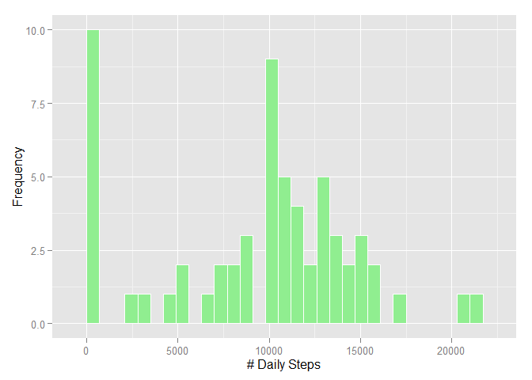
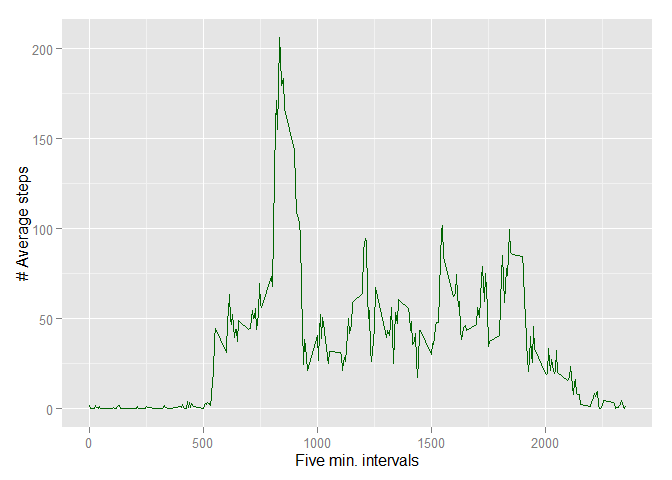
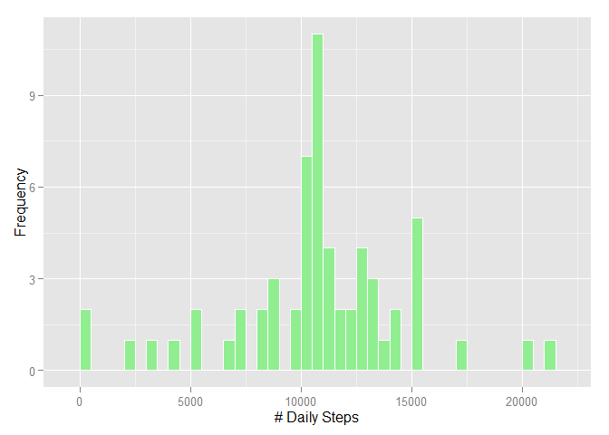
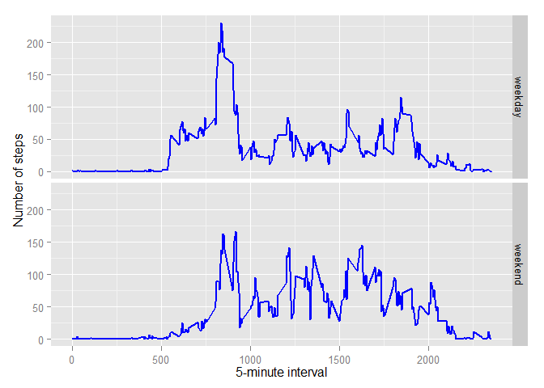

# Reproducible Research: Peer Assessment 1

## Loading and preprocessing the data

##### 1. Load the data (i.e. read.csv())

First, we load the data into R, making sure all NA and blank values are read as "NA".
Just to see what the data is like, let's also call head and summary functions on the dataset.

```r
activityRaw <- read.csv("~/data/activity.csv")
head(activityRaw)
```

```
##   steps       date interval
## 1    NA 2012-10-01        0
## 2    NA 2012-10-01        5
## 3    NA 2012-10-01       10
## 4    NA 2012-10-01       15
## 5    NA 2012-10-01       20
## 6    NA 2012-10-01       25
```

```r
summary(activityRaw)
```

```
##      steps               date          interval   
##  Min.   :  0.0   2012-10-01:  288   Min.   :   0  
##  1st Qu.:  0.0   2012-10-02:  288   1st Qu.: 589  
##  Median :  0.0   2012-10-03:  288   Median :1178  
##  Mean   : 37.4   2012-10-04:  288   Mean   :1178  
##  3rd Qu.: 12.0   2012-10-05:  288   3rd Qu.:1766  
##  Max.   :806.0   2012-10-06:  288   Max.   :2355  
##  NA's   :2304    (Other)   :15840
```

##### 2. Process/transform the data (if necessary) into a format suitable for your analysis

Next, to ensure the date column is in proper date format:

```r
activityRaw$date=as.Date(activityRaw$date,"%Y-%m-%d")
```

## What is mean total number of steps taken per day?
##### 1. Make a histogram of the total number of steps taken each day

To make a histogram of total number of steps taken each day, first we need to calculate those numbers.
We will use tapply functuin with "na.rm" for ignoring NA values.

```r
dailySteps <- tapply(activityRaw$steps,as.Date(activityRaw$date), sum, na.rm=TRUE)
```

Now, we can plot the histogram of total number of steps taken  per day using qplot.

```r
library(ggplot2)
qplot(dailySteps, binwidth=700, fill=I("lightgreen"),colour=I("white"), xlab= "# Daily Steps", ylab = "Frequency")
```

 

##### 2. Calculate and report the mean and median total number of steps taken per day
Mean toal number of steps taken per day:

```r
mean(dailySteps, na.rm=TRUE)
```

```
## [1] 9354
```
Median total number of steps taken per day:

```r
median(dailySteps, na.rm=TRUE)
```

```
## [1] 10395
```

## What is the average daily activity pattern?
##### 1. Make a time series plot (i.e. type = "l") of the 5-minute interval (x-axis) and the average number of steps taken, averaged across all days (y-axis)
We can use aggregate function to find the mean steps for each time interval as:

```r
avgPattern <- aggregate(steps ~ interval, data = activityRaw, mean, na.rm = TRUE)
```

Net, plotting the interval in time-series:

```r
qplot(x =avgPattern$interval , y = avgPattern$steps, geom = "line",
      xlab = "Five min. intervals", ylab = "# Average steps", 
      colour = I("darkgreen"))
```

 

##### 2. Which 5-minute interval, on average across all the days in the dataset, contains the maximum number of steps?
Finding which time interval has maximum number of average steps:

```r
avgPattern$interval[which.max(avgPattern$steps)]
```

```
## [1] 835
```

## Imputing missing values
##### 1. Calculate and report the total number of missing values in the dataset (i.e. the total number of rows with NAs)
Total number of missing values in original data:

```r
sum(!complete.cases(activityRaw))
```

```
## [1] 2304
```

##### 2. Devise a strategy for filling in all of the missing values in the dataset. The strategy does not need to be sophisticated. For example, you could use the mean/median for that day, or the mean for that 5-minute interval, etc.
To fill the missing values in the dataset, we will use the average values we calculated above for each time interval.

##### 3. Create a new dataset that is equal to the original dataset but with the missing data filled in.
Creating a new dateset to fill the missing values.

```r
activityFilled <- activityRaw  # This is to make a new dataset with the original data
```

Looping through the dataset to replace missing values:

```r
for (i in 1:nrow(activityFilled)) {                             #for entire length of dataset
        if (!complete.cases(activityFilled[i, ])) {             #IF, values is missing
                thisint <- activityFilled[i, ]$interval         #get the interval
                thisstep <- avgPattern[avgPattern$interval == thisint, ]$steps  #From averagePattern dataset, get average steps for the interval
                activityFilled[i, ]$steps  <- thisstep          #set that average num. to the new dataset
        }
}
```

##### 4. Make a histogram of the total number of steps taken each day and Calculate and report the mean and median total number of steps taken per day. Do these values differ from the estimates from the first part of the assignment? What is the impact of imputing missing data on the estimates of the total daily number of steps?
Again, with the new dataset with missing values filled, we can re-calculate the total steps per day.
And then we can re-plot the histogram to see if there are any significant changes.

```r
library(ggplot2)
dailySteps2 <- tapply(activityFilled$steps, activityFilled$date, sum, na.rm = TRUE)
qplot(dailySteps2, binwidth = 500, colour=I("white"), fill = I("lightgreen"),
       xlab= "# Daily Steps", ylab = "Frequency")
```

 

Mean total steps taken per day:

```r
mean(dailySteps2)
```

```
## [1] 10766
```
Median total steps taken per day:

```r
median(dailySteps2)
```

```
## [1] 10766
```
The mean and median values are slightly higher than the previous ones.
This is reasonable, because we added 2034 missing values with overall averages for that period.
And this would raise the new overall average.

## Are there differences in activity patterns between weekdays and weekends?
##### 1. Create a new factor variable in the dataset with two levels -- "weekday" and "weekend" indicating whether a given date is a weekday or weekend day.
We can use timeDate library to easily categorise days into weekdays and weekends.

```r
library(timeDate)
activity_wkday = data.frame(activityFilled)
activity_wkday$daygroup = as.factor(ifelse(isWeekday(activity_wkday$date), "weekday", "weekend"))
```

##### 2. Make a panel plot containing a time series plot (i.e. type = "l") of the 5-minute interval (x-axis) and the average number of steps taken, averaged across all weekday days or weekend days (y-axis). The plot should look something like the following, which was created using simulated data:
Next, we can aggregate the data as done above, and make then panel plot.

```r
averages <- aggregate(steps ~ interval + daygroup, data = activity_wkday, mean)
```

```r
ggplot(averages, aes(interval, steps)) + geom_line(colour="blue",size=0.8) + facet_grid(daygroup ~ .) + 
        xlab("5-minute interval") + ylab("Number of steps" )
```

 
